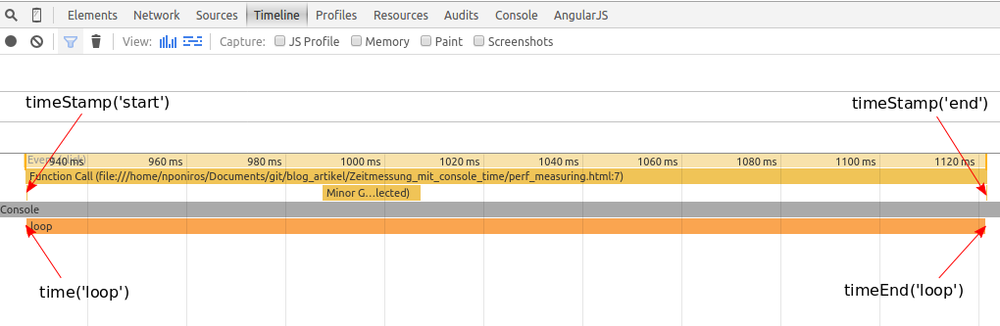

Performance-Optimierung ist ein wichtiger Aspekt bei der Entwicklung einer Webanwendung. Um in der Lage zu sein, Code zu optimieren, müssen wir auch in der Lage sein, die benötigte Zeit zu messen, um den Code auszuführen. Moderne Browser bieten uns einige Möglichkeiten, um JavaScript-Performance zu messen, die alle ihre Vor- und Nachteile haben. Ein sehr einfacher Weg, um die Ausführungszeit zu messen, ist es, die console-API zu nutzen. Konkreter bieten uns moderne Browser die _console.time()_ und _console.timeEnd()_ Funktionen an.

Die _console.time()_ Funktion startet einen Timer, der die Zeit misst zwischen dem _console.time()_ Aufruf und dem _console.timeEnd()_ Aufruf. Damit das Ganze auch richtig funktioniert, müssen wir den beiden Funktionen einen Namen als Parameter übergeben. Hier ein Beispiel, wie das funktioniert:

```javascript
// Timer mit Namen "loop" starten
console.time('loop');

var j = '';
for (var i = 0; i < 1000000; i++) {
  j += i;
}

// Timer mit Namen "loop" stoppen
console.timeEnd('loop');
```

Nachdem __console.timeEnd('loop')__ aufgerufen worden ist, wird in der Konsole die vergangene Zeit in Millisekunden angezeigt. Somit können wir mit relativ wenig Aufwand die Zeit messen, die ein Codeabschnitt braucht, um ausgeführt zu werden. Die Genauigkeit der angezeigten Zeit kann von Browser zu Browser verschieden sein. Neue Chrome- und Firefox- Versionen zeigen die Zeit mikrosekundengenau an. Die console-API zu nutzen für die Zeitmessung ist nicht nur einfach, sie hat auch einen weiteren Vorteil: Der Zeitraum zwischen __console.time()__ und __console.timeEnd()__ wird auch in der Chrome-Timeline angezeigt und im Performance-Analyse-Tool von Firefox. Somit haben wir die Möglichkeit, nicht nur die Zeit einer Funktion für ihre Ausführung zu visualisieren, sondern auch die hierfür benötigte Zeit der einzelnen Teile der Funktion.

Die console-API bietet uns auch eine weitere Funktion, an die uns bei der Visualisierung unterstützt, und zwar die _console.timeStamp()_- Funktion. Damit können wir Markierungen im Code setzen, die dann im Performance-Analyse-Tool des Browsers sichtbar sind. Optional können wir der Funktion auch einen Namen übergeben, der dann mit der Markierung in den Browser-Tools sichtbar ist. Mit Hilfe dieser Funktion ist es relativ einfach, Teile unseres Codes an verschiedenen Ereignissen wie z. B. Paint und Layout zuzuordnen. Hier noch ein Beispiel mit allen drei console-Funktionen und wie die Chrome-Timeline für den Beispiel-Code aussehen kann:

```javascript
function run() {
  console.timeStamp('start');

  var j = '';
  console.time('loop');
  for (var i = 0; i < 1000000; i++) {
    j += i;
  }
  console.timeEnd('loop');
  console.timeStamp('end');
}
```


